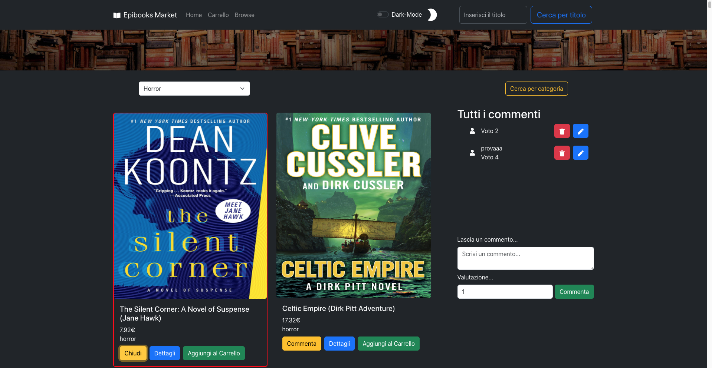

### EpiBooks



EpiBooks è una Web App che consente di selezionare libri, commentarli e aggiungerli al carrello.

## Features 📱

📃 Ricerca tramite barra di ricerca per nome del libro.  
📄 Ricerca tramite categoria del libro.  
🌑 Modalita Dark-Mode.  
📓 Pagina di dettaglio con possibilità di visualizzare maggiori info sul libro e poter commentare.  
💳 Carrello che gestisce la quantità e i prezzi con possibilità di eliminare il libro/quantità di libri

## Setup

Carica il progetto e scarica tutte le dependecies
```
npm install
```
Esegui il setup del Bearer Token fornito a questo link https://strive.school/studentlogin, quindi entra nel file .env e aggiungi il tuo token

Esegui 
```
npm start
```

## Tecnologie utilizzate

HTML, CSS, JavaScript, Bootstrap, React